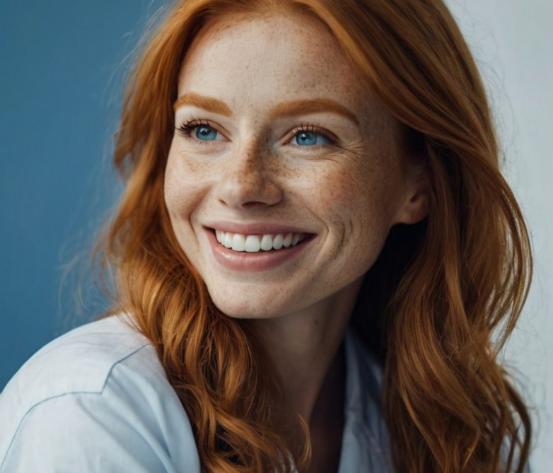

# DreamDent — лендинг семейной стоматологии «ДРИМ»

Адаптивная вёрстка по образцу [dreamdent.ru](https://dreamdent.ru/): семантический HTML5, современный CSS (без фреймворков), мобильное меню на ванильном JS.

## Структура
```
DreamDent/
├── index.html        # разметка страницы
├── css/style.css     # стили: токены, компоненты, секции, адаптив
├── js/main.js        # бургер-меню
├── images/           # SVG-плейсхолдеры (заменить на реальные фото)
└── README.md
```

## Запуск
Откройте `index.html` в браузере или поднимите статику:
```bash
npx serve .        # или: python -m http.server 8000
```

## Картинки
В `images/` лежат реальные фото с сайта (логотип, врачи, работы, лицензии, интерьер).
Крупные изображения (hero, интерьер, лицензии) сконвертированы в **WebP** и подключены через
`<picture>` с JPG-фолбэком. Если будете добавлять новые — оптимизируйте так же:

1. **Формат.** Отдавайте `AVIF`/`WebP` с фолбэком через `<picture>`:
   ```html
   <picture>
     <source type="image/avif" srcset="images/hero.avif">
     <source type="image/webp" srcset="images/hero.webp">
     
   </picture>
   ```
2. **Адаптивность.** Добавляйте `srcset`/`sizes` под ретину и разные экраны.
3. **CLS.** У всех `` уже проставлены `width`/`height` — сохраняйте при замене.
4. **Ленивость.** Все фото ниже первого экрана помечены `loading="lazy"`; у hero — `fetchpriority="high"`.
5. **Сжатие.** `squoosh`, `sharp`, `cwebp -q 80`, `avifenc`. Цель: hero < 150 КБ, карточки < 60 КБ.

## Современные доработки (реализовано)
- Появление секций/карточек при скролле (IntersectionObserver, со «ступенчатой» задержкой)
- Анимированный счётчик в блоке цифр
- Hero: асимметричное скругление фото, мягкая подложка-«блоб», плавающий бейдж рейтинга
- «Наши работы» — галерея с лайтбоксом (клик = увеличение) и hover-зумом
- Иконки услуг с градиентом, мягкие тени
- Микроразметка Schema.org (`Dentist` + `AggregateRating`) в `<head>`
- Сводный рейтинг и ссылка на отзывы в Яндекс.Картах
- Всё уважает `prefers-reduced-motion`
- Подсветка активного пункта меню при скролле (scroll-spy)
- Кнопка «наверх» и плавающая кнопка WhatsApp
- Шапка не ломается в планшетном диапазоне (769–1080px скрыт номер и подпись лого)

## Что ещё стоит улучшить (бэклог)
- [ ] Подключить реальную форму записи (отправка на бэкенд/CRM, маска телефона, валидация)
- [ ] Микроразметка Schema.org (`Dentist`, `MedicalClinic`, `AggregateRating`) для SEO
- [ ] `favicon`, `apple-touch-icon`, `site.webmanifest`
- [ ] Самохостинг шрифтов (`woff2` + `preload`) вместо Google Fonts — быстрее и без внешней зависимости
- [ ] Реальные ссылки на отзывы (Яндекс.Карты), фильтр работ по категориям
- [ ] Страница политики обработки ПДн (сейчас заглушка `#`)
- [ ] Минификация CSS/JS и кэш-заголовки на проде
- [ ] Проверка Lighthouse (Performance / A11y / SEO) и axe

## Доступность
- Skip-link, `aria`-атрибуты у меню, фокус-стили, `prefers-reduced-motion`
- Контраст текста и кнопок соответствует WCAG AA
